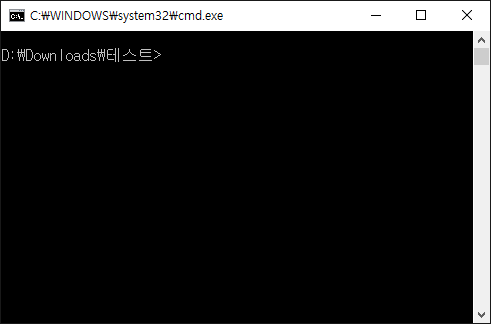

# MCAddon Start
## 이 패키지는 뭐죠?
**웹팩과 타입스크립트**를 사용하는 마인크래프트 애드온 프로젝트를 생성할 수 있어요!
  
Read this in other languages: [English](README.md), [한국어](README.ko_KR.md)

## 어떻게 사용하죠?


* 스탭 1
[VSCode](https://code.visualstudio.com/)와 [NodeJS](https://nodejs.org/en/)를 설치해주세요!
* 스탭 2
터미널 열기 - 윈도우에서는 `윈도우키 + R -> cmd -> 엔터`로 터미널을 열 수 있어요  
그리고 밑에 있는 명령를 터미널에서 실행시켜주세요
```sh
cd C:\프로젝트\폴더\위치 ## 프로젝트 폴더로 이동해요. 이 위치는 가짜이니 바꿔주세요
npm i -g mcaddon-start  ## mcaddon-start를 설치해요
mcaddon-start [프로젝트 이름] ## 여기서 프로젝트가 생성될거에요
```
* 스탭 3
생성된 디렉토리를 VSCode로 열어주세요(`code` 명령어를 사용할 수 있게 설정해놨으면 자동으로 열릴거에요)  
`Ctrl + Shift + B`를 누른 다음 `Watch` 를 선택하면 자동 빌드가 되요  
스크립트 파일은 `src/server/index.ts`에 있어요!  
[Typescript + Webpack Problem Matchers](https://marketplace.visualstudio.com/items?itemName=eamodio.tsl-problem-matcher) 설치를 권장해드려요!
